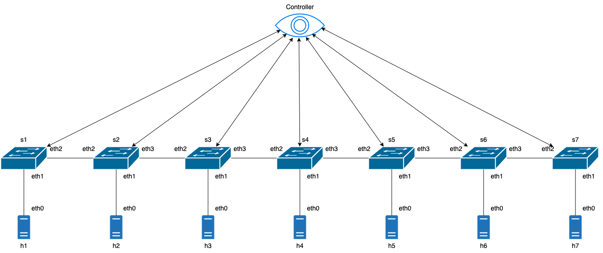
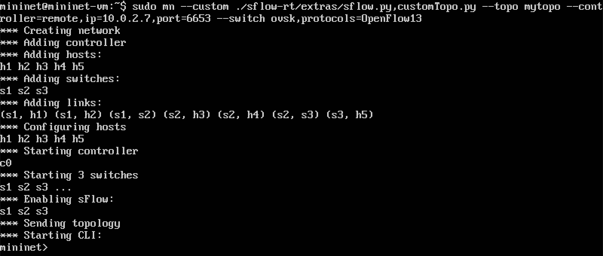
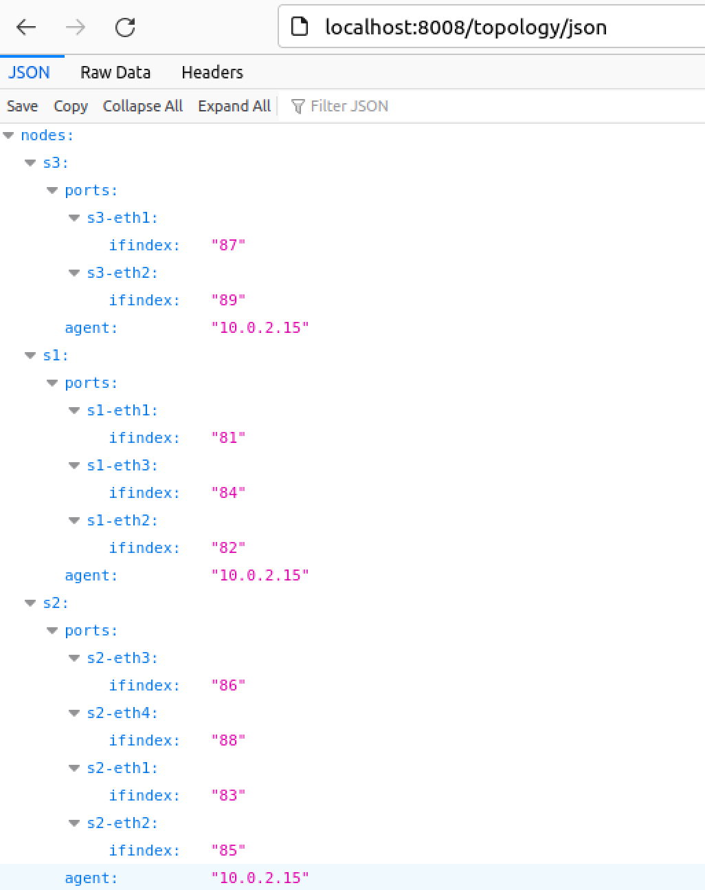

# TP SDN

Dans ce TP nous allons partir à la découverte des réseaux SDN à travers le protocole Openflow.

Les outils utilisés pour réalisés seront (listes non exhaustives) :

* Mininet 

* Floodlight 

* SflowRT  

* Wireshark

Vous devrez fournir un rapport de TP avec les réponses aux questions posées, les schémas demandés, et tout ce qui vous semblera pertinent.

Il n’y a pas de « tutoriel » comme vous avez pu en avoir dans vos années d’études antérieures. Vous utiliserez votre savoir ainsi qu’internet pour avancer dans le TP et répondre aux questions.

L’enseignant reste à disposition pour vous accompagner.

## Mininet

Dans un premier temps, nous allons nous concentrer en particulier sur Mininet. Pour faciliter son installation, nous allons utiliser une machine virtuelle ou mininet est déjà installé.

Vous pouvez télécharger l’image ici : https://github.com/mininet/mininet/releases

Après l’installation (avec VMWare ou VirtualBox), veillez à configurer votre réseau (onglet réseau dans VB ou VMWare) de manière à ce que le contrôleur floodlight puisse y accéder par la suite. (NAT ? Bridge ?
autres ?)

> Note : Pour passer le clavier en azerty sur la vm:
> 
> ```
> $ sudo loadkeys fr
> ```

**1- Quelle configuration réseau avez-vous choisi ? Pourquoi ?**

* Pour le moment, on utilise pas floodlight
  <u>Je vais faire l'hypothèse qu'on l'installe sur une VM séparée.</u>
  Etant sur un Macbook Air, je ne dispose que d'une interface connectée en WiFi. 
  
  D'après les sources que j'ai trouvé sur internet,  ma configuration avec le mode *Bridged adapter* (le plus simple en théorie) au mieux fonctionne hasardeusement et au pire ne fonctionne pas du tout. 
  
  C'est pour cette raison que j'utilise plutôt un Nat Network.
  
  1. *VirtualBox > Preferences > Network* puis je créé un réseau *NatNetwork* 10.0.2.0/24
  
  2. Dans les réglages des VMs Mininet & Floodlight, 
     j'ajoute une interface avec les paramètres suivants : 
     
     1. attached to : *NAT Network*
     
     2. name : *NatNetwork*

---

Dans mininet (mn pour les intimes), il existe plusieurs topologies réseaux proposées que l’on peut configurer via des lignes de commandes.

**2-  Est-il possible de personnaliser les topologies et de monter des topologies non disponible en ligne de commande ? Si oui, comment ?** 

* Trois options s'offrent à nous : 
  
  1. L'option par défaut : la topologie minimal
     
     ```bash
     mininet@mininet-vm:~$ sudo mn
     ```
  
  2. les topologies "Out of the box"
     
     ```bash
     mininet@mininet-vm:~$ sudo mn -h
     [...]
       --topo=TOPO           linear|minimal|reversed|single|torus|tree[,param=value
                             ...] minimal=MinimalTopo linear=LinearTopo
     [...]
     ```
  
  3. les "Custom Topologies"
     Décrites dans la documentation :
     *Custom topologies can be easily defined as well, using a simple Python API, and an example is provided in `custom/topo-2sw-2host.py`. This example connects two switches directly, with a single host off each switch:*

---

**3-  Quelle est la topologie réseau par défaut ? Comment « prouver » cette topologie via une ligne de commande ?**

* la topologie réseau par défaut est appelée "minimal"

* On peut utiliser la commande "net" pour visualiser si notre topologie correspond bien à l'architecture de la topologie minimale :
  
  ```bash
  mininet> net
  h1 h1-eth0:s1-eth1
  h2 h2-eth0:s1-eth2
  s1 lo:  s1-eth1:h1-eth0 s1-eth2:h2-eth0
  c0
  ```

---

**4-  Décrire la topologie « linear » fournit par mininet. Est-ce une topologie applicable dans le monde réel selon vous (intérêt, cout, résilience, scalabilité, ...)**

* Chaque switch est relié à un host. Irréaliste dans la réalité.
  
  * Intérêt limité
  
  * Cout énorme
  
  * la perte d'un switch entraîne l'isolement du host rattaché
  
  * Faible scalabilité 

---

Lancer mininet (sudo mn). 

**5- Par défaut, quels éléments ont été créés ? Est-ce cohérent avec votre réponse à la question 3 ?**

```bash
mininet@mininet-vm:~$ sudo mn
*** Creating network
*** Adding controller
*** Adding hosts:
h1 h2 
*** Adding switches:
s1 
*** Adding links:
(h1, s1) (h2, s1) 
*** Configuring hosts
h1 h2 
*** Starting controller
c0 
*** Starting 1 switches
s1 ...
*** Starting CLI:
mininet> 
```

En cohérence avec la réponse à la question 3

---

**6-  Une fois le réseau crée, il existe quelques commandes pour décrire le réseau (présence de nœuds, réseau des hosts, nom des hosts, etc...), donnez quelques commandes utiles (selon vous) et décrivez succinctement leur fonctionnement.**

```bash
mininet> nodes #allow to see all nodes
available nodes are: 
c0 h1 h2 s1
mininet> net #allow to see network interfaces and how they are interconnected
h1 h1-eth0:s1-eth1
h2 h2-eth0:s1-eth2
s1 lo:  s1-eth1:h1-eth0 s1-eth2:h2-eth0
c0
mininet> dump #complementary to node command, allow to see @ip and process ids on mininet VM 
<Host h1: h1-eth0:10.0.0.1 pid=935> 
<Host h2: h2-eth0:10.0.0.2 pid=938> 
<OVSSwitch s1: lo:127.0.0.1,s1-eth1:None,s1-eth2:None pid=943> 
<Controller c0: 127.0.0.1:6653 pid=927> 
mininet> 
mininet> links
h1-eth0<->s1-eth1 (OK OK) 
h2-eth0<->s1-eth2 (OK OK) 
mininet> 
mininet> intfs
h1: h1-eth0
h2: h2-eth0
s1: lo,s1-eth1,s1-eth2
c0: 
mininet> 
```

---

**7-  Quelles sont les IP de vos « hosts ».**

* h1 : 10.0.0.1

* h2 : 10.0.0.2

---

**8-  Assurez-vous que vos hosts sont bien interconnectés. Comment vous y prenez-vous ?**

* avec un ping : 
  
  ```bash
  # DEPUIS H1
  mininet> h1 ping -c 5 h2
  PING 10.0.0.2 (10.0.0.2) 56(84) bytes of data.
  64 bytes from 10.0.0.2: icmp_seq=1 ttl=64 time=0.305 ms
  64 bytes from 10.0.0.2: icmp_seq=2 ttl=64 time=0.063 ms
  64 bytes from 10.0.0.2: icmp_seq=3 ttl=64 time=0.081 ms
  64 bytes from 10.0.0.2: icmp_seq=4 ttl=64 time=0.065 ms
  64 bytes from 10.0.0.2: icmp_seq=5 ttl=64 time=0.269 ms
  
  --- 10.0.0.2 ping statistics ---
  5 packets transmitted, 5 received, 0% packet loss, time 4073ms
  rtt min/avg/max/mdev = 0.063/0.156/0.305/0.107 ms
  mininet> 
  
  # DEPUIS H2
  mininet> h2 ping -c 5 h1
  PING 10.0.0.1 (10.0.0.1) 56(84) bytes of data.
  64 bytes from 10.0.0.1: icmp_seq=1 ttl=64 time=1.24 ms
  64 bytes from 10.0.0.1: icmp_seq=2 ttl=64 time=0.082 ms
  64 bytes from 10.0.0.1: icmp_seq=3 ttl=64 time=0.064 ms
  64 bytes from 10.0.0.1: icmp_seq=4 ttl=64 time=0.080 ms
  64 bytes from 10.0.0.1: icmp_seq=5 ttl=64 time=0.049 ms
  
  --- 10.0.0.1 ping statistics ---
  5 packets transmitted, 5 received, 0% packet loss, time 4075ms
  rtt min/avg/max/mdev = 0.049/0.303/1.241/0.469 ms
  mininet> 
  ```

---

**9- Eteignez un des nœuds. Assurez-vous que le (ou les) autres nœuds ne sont plus interconnectés avec le nœud éteint. Comment vous y prenez-vous ?**

```bash
mininet> link h1 s1 down
mininet> h1 ip a
1: lo: <LOOPBACK,UP,LOWER_UP> mtu 65536 qdisc noqueue state UNKNOWN group default qlen 1000
    link/loopback 00:00:00:00:00:00 brd 00:00:00:00:00:00
    inet 127.0.0.1/8 scope host lo
       valid_lft forever preferred_lft forever
2: h1-eth0@if24: <BROADCAST,MULTICAST> mtu 1500 qdisc noqueue state DOWN group default qlen 1000
    link/ether 5a:55:9b:a2:7c:87 brd ff:ff:ff:ff:ff:ff link-netnsid 0
    inet 10.0.0.1/8 brd 10.255.255.255 scope global h1-eth0
       valid_lft forever preferred_lft forever
mininet> 
mininet> s1 ip a
1: lo: <LOOPBACK,UP,LOWER_UP> mtu 65536 qdisc noqueue state UNKNOWN group default qlen 1000
    link/loopback 00:00:00:00:00:00 brd 00:00:00:00:00:00
    inet 127.0.0.1/8 scope host lo
       valid_lft forever preferred_lft forever
2: eth0: <BROADCAST,MULTICAST,UP,LOWER_UP> mtu 1500 qdisc fq_codel state UP group default qlen 1000
    link/ether 08:00:27:ad:25:98 brd ff:ff:ff:ff:ff:ff
    inet 192.168.56.101/24 brd 192.168.56.255 scope global dynamic eth0
       valid_lft 592sec preferred_lft 592sec
3: eth1: <BROADCAST,MULTICAST,UP,LOWER_UP> mtu 1500 qdisc fq_codel state UP group default qlen 1000
    link/ether 08:00:27:b6:e9:d9 brd ff:ff:ff:ff:ff:ff
    inet 10.0.2.15/24 brd 10.0.2.255 scope global dynamic eth1
       valid_lft 73204sec preferred_lft 73204sec
24: s1-eth1@if2: <BROADCAST,MULTICAST> mtu 1500 qdisc noqueue master ovs-system state DOWN group default qlen 1000
    link/ether b2:01:a0:37:92:77 brd ff:ff:ff:ff:ff:ff link-netnsid 0
25: s1-eth2@if2: <BROADCAST,MULTICAST,UP,LOWER_UP> mtu 1500 qdisc noqueue master ovs-system state UP group default qlen 1000
    link/ether 3e:e3:8b:c7:43:1c brd ff:ff:ff:ff:ff:ff link-netnsid 1
26: ovs-system: <BROADCAST,MULTICAST> mtu 1500 qdisc noop state DOWN group default qlen 1000
    link/ether 72:08:23:c0:f6:9a brd ff:ff:ff:ff:ff:ff
27: s1: <BROADCAST,MULTICAST> mtu 1500 qdisc noop state DOWN group default qlen 1000
    link/ether 1a:bd:81:c1:95:41 brd ff:ff:ff:ff:ff:ff
```

---

**10-  Réactivez le nœud éteint. Assurez-vous qu’il ping à nouveau.**

```bash
mininet> link h1 s1 up  
mininet> h1 ip a
1: lo: <LOOPBACK,UP,LOWER_UP> mtu 65536 qdisc noqueue state UNKNOWN group default qlen 1000
    link/loopback 00:00:00:00:00:00 brd 00:00:00:00:00:00
    inet 127.0.0.1/8 scope host lo
       valid_lft forever preferred_lft forever
2: h1-eth0@if24: <BROADCAST,MULTICAST,UP,LOWER_UP> mtu 1500 qdisc noqueue state UP group default qlen 1000
    link/ether 5a:55:9b:a2:7c:87 brd ff:ff:ff:ff:ff:ff link-netnsid 0
    inet 10.0.0.1/8 brd 10.255.255.255 scope global h1-eth0
       valid_lft forever preferred_lft forever
mininet> 
mininet> s1 ip a
1: lo: <LOOPBACK,UP,LOWER_UP> mtu 65536 qdisc noqueue state UNKNOWN group default qlen 1000
    link/loopback 00:00:00:00:00:00 brd 00:00:00:00:00:00
    inet 127.0.0.1/8 scope host lo
       valid_lft forever preferred_lft forever
2: eth0: <BROADCAST,MULTICAST,UP,LOWER_UP> mtu 1500 qdisc fq_codel state UP group default qlen 1000
    link/ether 08:00:27:ad:25:98 brd ff:ff:ff:ff:ff:ff
    inet 192.168.56.101/24 brd 192.168.56.255 scope global dynamic eth0
       valid_lft 469sec preferred_lft 469sec
3: eth1: <BROADCAST,MULTICAST,UP,LOWER_UP> mtu 1500 qdisc fq_codel state UP group default qlen 1000
    link/ether 08:00:27:b6:e9:d9 brd ff:ff:ff:ff:ff:ff
    inet 10.0.2.15/24 brd 10.0.2.255 scope global dynamic eth1
       valid_lft 73081sec preferred_lft 73081sec
24: s1-eth1@if2: <BROADCAST,MULTICAST,UP,LOWER_UP> mtu 1500 qdisc noqueue master ovs-system state UP group default qlen 1000
    link/ether b2:01:a0:37:92:77 brd ff:ff:ff:ff:ff:ff link-netnsid 0
25: s1-eth2@if2: <BROADCAST,MULTICAST,UP,LOWER_UP> mtu 1500 qdisc noqueue master ovs-system state UP group default qlen 1000
    link/ether 3e:e3:8b:c7:43:1c brd ff:ff:ff:ff:ff:ff link-netnsid 1
26: ovs-system: <BROADCAST,MULTICAST> mtu 1500 qdisc noop state DOWN group default qlen 1000
    link/ether 72:08:23:c0:f6:9a brd ff:ff:ff:ff:ff:ff
27: s1: <BROADCAST,MULTICAST> mtu 1500 qdisc noop state DOWN group default qlen 1000
    link/ether 1a:bd:81:c1:95:41 brd ff:ff:ff:ff:ff:ff
```

## Mininet personnalisé

Avant tout, n’oubliez pas de supprimer vos anciennes architectures avant d’en créer une nouvelle. Cela vous évitera de mauvaises surprises, il existe une commande pour « clear » votre architecture avant de relancer mn.

```bash
mininet@mininet-vm:~$ sudo mn -c
*** Removing excess controllers/ofprotocols/ofdatapaths/pings/noxes
killall controller ofprotocol ofdatapath ping nox_corelt-nox_core ovs-openflowd ovs-controllerovs-testcontroller udpbwtest mnexec ivs ryu-manager 2> /dev/null
killall -9 controller ofprotocol ofdatapath ping nox_corelt-nox_core ovs-openflowd ovs-controllerovs-testcontroller udpbwtest mnexec ivs ryu-manager 2> /dev/null
pkill -9 -f "sudo mnexec"
*** Removing junk from /tmp
rm -f /tmp/vconn* /tmp/vlogs* /tmp/*.out /tmp/*.log
*** Removing old X11 tunnels
*** Removing excess kernel datapaths
ps ax | egrep -o 'dp[0-9]+' | sed 's/dp/nl:/'
***  Removing OVS datapaths
ovs-vsctl --timeout=1 list-br
ovs-vsctl --timeout=1 list-br
*** Removing all links of the pattern foo-ethX
ip link show | egrep -o '([-_.[:alnum:]]+-eth[[:digit:]]+)'
ip link show
*** Killing stale mininet node processes
pkill -9 -f mininet:
*** Shutting down stale tunnels
pkill -9 -f Tunnel=Ethernet
pkill -9 -f .ssh/mn
rm -f ~/.ssh/mn/*
*** Cleanup complete.
mininet@mininet-vm:~$ 
```

Nous allons maintenant tester une topologie un peu plus complexe, la topologie « linear » proposée par mininet. Nous jouerons avec quelques paramètre pour tenter de rendre notre réseau plus en lien avec la réalité (bande passante, latence, ...).

---

**11-  Créez une topologie linear 7, pour rendre cette topologie plus réels, nous allons limiter sa bande passante à 20Mbps et nous ajouterons un « delay » de 3ms.**

```bash
mininet@mininet-vm:~$ sudo mn --topo linear,7 --link tc,bw=20,delay=3
*** Creating network
*** Adding controller
*** Adding hosts:
h1 h2 h3 h4 h5 h6 h7 
*** Adding switches:
s1 s2 s3 s4 s5 s6 s7 
*** Adding links:
(20.00Mbit 3 delay) (20.00Mbit 3 delay) (h1, s1) (20.00Mbit 3 delay) (20.00Mbit 3 delay) (h2, s2) (20.00Mbit 3 delay) (20.00Mbit 3 delay) (h3, s3) (20.00Mbit 3 delay) (20.00Mbit 3 delay) (h4, s4) (20.00Mbit 3 delay) (20.00Mbit 3 delay) (h5, s5) (20.00Mbit 3 delay) (20.00Mbit 3 delay) (h6, s6) (20.00Mbit 3 delay) (20.00Mbit 3 delay) (h7, s7) (20.00Mbit 3 delay) (20.00Mbit 3 delay) (s2, s1) (20.00Mbit 3 delay) (20.00Mbit 3 delay) (s3, s2) (20.00Mbit 3 delay) (20.00Mbit 3 delay) (s4, s3) (20.00Mbit 3 delay) (20.00Mbit 3 delay) (s5, s4) (20.00Mbit 3 delay) (20.00Mbit 3 delay) (s6, s5) (20.00Mbit 3 delay) (20.00Mbit 3 delay) (s7, s6) 
*** Configuring hosts
h1 h2 h3 h4 h5 h6 h7 
*** Starting controller
c0 
*** Starting 7 switches
s1 s2 s3 s4 s5 s6 s7 ...(20.00Mbit 3 delay) (20.00Mbit 3 delay) (20.00Mbit 3 delay) (20.00Mbit 3 delay) (20.00Mbit 3 delay) (20.00Mbit 3 delay) (20.00Mbit 3 delay) (20.00Mbit 3 delay) (20.00Mbit 3 delay) (20.00Mbit 3 delay) (20.00Mbit 3 delay) (20.00Mbit 3 delay) (20.00Mbit 3 delay) (20.00Mbit 3 delay) (20.00Mbit 3 delay) (20.00Mbit 3 delay) (20.00Mbit 3 delay) (20.00Mbit 3 delay) (20.00Mbit 3 delay) 
*** Starting CLI:
mininet> 
```

---

**12-  Donnez le schéma de votre nouvelle topologie.**

```bash
mininet> net
h1 h1-eth0:s1-eth1
h2 h2-eth0:s2-eth1
h3 h3-eth0:s3-eth1
h4 h4-eth0:s4-eth1
h5 h5-eth0:s5-eth1
h6 h6-eth0:s6-eth1
h7 h7-eth0:s7-eth1
s1 lo:  s1-eth1:h1-eth0 s1-eth2:s2-eth2
s2 lo:  s2-eth1:h2-eth0 s2-eth2:s1-eth2 s2-eth3:s3-eth2
s3 lo:  s3-eth1:h3-eth0 s3-eth2:s2-eth3 s3-eth3:s4-eth2
s4 lo:  s4-eth1:h4-eth0 s4-eth2:s3-eth3 s4-eth3:s5-eth2
s5 lo:  s5-eth1:h5-eth0 s5-eth2:s4-eth3 s5-eth3:s6-eth2
s6 lo:  s6-eth1:h6-eth0 s6-eth2:s5-eth3 s6-eth3:s7-eth2
s7 lo:  s7-eth1:h7-eth0 s7-eth2:s6-eth3
c0
```



---

**13- Faites un ping entre vos machines. Le résultat du ping est-il cohérent ? Il existe différente variante de ping dans mininet (ping full, ...), n’hésitez pas à les explorer !**

* résultat cohérent    

```bash
mininet> h1 ping h2
PING 10.0.0.2 (10.0.0.2) 56(84) bytes of data.
64 bytes from 10.0.0.2: icmp_seq=1 ttl=64 time=15.4 ms
64 bytes from 10.0.0.2: icmp_seq=2 ttl=64 time=1.51 ms
^C
--- 10.0.0.2 ping statistics ---
2 packets transmitted, 2 received, 0% packet loss, time 1001ms
rtt min/avg/max/mdev = 1.505/8.436/15.367/6.931 ms
mininet> h1 ping h3
PING 10.0.0.3 (10.0.0.3) 56(84) bytes of data.
64 bytes from 10.0.0.3: icmp_seq=1 ttl=64 time=11.6 ms
64 bytes from 10.0.0.3: icmp_seq=2 ttl=64 time=1.79 ms
^C
--- 10.0.0.3 ping statistics ---
2 packets transmitted, 2 received, 0% packet loss, time 1001ms
rtt min/avg/max/mdev = 1.792/6.697/11.602/4.905 ms
mininet> h1 ping h4
PING 10.0.0.4 (10.0.0.4) 56(84) bytes of data.
64 bytes from 10.0.0.4: icmp_seq=1 ttl=64 time=16.3 ms
64 bytes from 10.0.0.4: icmp_seq=2 ttl=64 time=2.31 ms
^C
--- 10.0.0.4 ping statistics ---
2 packets transmitted, 2 received, 0% packet loss, time 1001ms
rtt min/avg/max/mdev = 2.307/9.308/16.310/7.001 ms
mininet> pingall
*** Ping: testing ping reachability
h1 -> h2 h3 h4 h5 h6 h7 
h2 -> h1 h3 h4 h5 h6 h7 
h3 -> h1 h2 h4 h5 h6 h7 
h4 -> h1 h2 h3 h5 h6 h7 
h5 -> h1 h2 h3 h4 h6 h7 
h6 -> h1 h2 h3 h4 h5 h7 
h7 -> h1 h2 h3 h4 h5 h6 
*** Results: 0% dropped (42/42 received)
mininet> 
```

---

Mininet nous permet de faire des tests de performance de notre architecture en mesurant la bande passante par exemple.

**14- Faites un test de performance et interpréter le résultat.**

```bash
mininet> iperf h7 h1
*** Iperf: testing TCP bandwidth between h7 and h1 
*** Results: ['19.1 Mbits/sec', '22.8 Mbits/sec']
mininet> iperf h1 h7
*** Iperf: testing TCP bandwidth between h1 and h7 
*** Results: ['19.1 Mbits/sec', '22.6 Mbits/sec']
mininet> 
```

On voit bien que les débits sont autour de 20 Mbits/sec.

On note cependant une différence entre les débits clients et serveur. 

La première valeur correspondant au serveur affiche un débit de 19,1 Mbit/sec alors que la valeur du client affiche un résultat différent de 22,8 Mbits/sec. 

Je n'ai  pas trouvé d'explications à ce constat. 

## Floodlight

Nous allons utiliser le contrôleur Floodlight en remplacement du contrôleur de base. Nous allons ensuite interconnecter notre contrôleur floodlight avec mininet afin d’observer la topologie.

**15- Installez floodlight sur votre hyperviseur (donc pas sur la machine mininet).**

Je crée ma VM à partir de la *Floodlight Linux VM* à disposition sur le site d'[Atlassian](https://floodlight.atlassian.net/wiki/spaces/floodlightcontroller/pages/1343544/Installation+Guide)

---

**16- Connectez mininet à floodlight (en précisant à mininet que le contrôleur est « remote » et en précisant l’IP:PORT de floodlight)**

* Démarrage de Floodlight sur la Floodlight-VM :
  
  ```bash
  ~$ cd floodlight/
  ~/floodlight$ ant
  ~/floodlight$ java -jar target/floodlight.jar
  ```

* Depuis la Mininet-VM, connexion vers le contrôleur Floodlight : 
  
  ```bash
  $ sudo mn --controller=remote,ip=10.0.2.6,port=6653 --switch ovsk,protocols=OpenFlow13
  *** Creating network
  *** Adding controller
  *** Adding hosts:
  h1 h2
  *** Adding switches:
  s1
  *** Adding links:
  (h1,s1) ()h2, s1)
  *** Configuring hosts
  h1 12
  *** Starting controller
  cO
  *** Starting 1 switches
  s1
  *** Starting CLI:
  mininet>
  ```

---

**17- Connectez-vous à l’interface web floodlight (certainement http://localhost:8080)**

Vous pouvez voir votre topologie en cliquant sur l’onglet « topology » sur la gauche. Explorez l’interface WEB, découvrez les différentes possibilités qu’offre l’interface.


## Programmation des réseaux.

Dans un second temps, nous allons programmer le déploiement d’une architecture personnalisée.

**18- A l’aide de python et des bibliothèques mininet, programmez le déploiement de l’architecture suivante. Attention au latence entre les liens. Vous trouverez des tas d’exemples python sur internet pour vous aider. A vous de les adapter. Vous fournirez votre code.**

N’hésitez pas à vous inspirer des exemples officiels : http://mininet.org/walkthrough/#custom-topologies


je construit le fichier *customTopo.py* :

```python
from mininet.topo import Topo

class MyTopo( Topo ):
    "Simple topology example."

    def build( self ):
        # Add hosts and switches
        host1 = self.addHost( 'h1' )
        host2 = self.addHost( 'h2' )
        host3 = self.addHost( 'h3' )
        host4 = self.addHost( 'h4' )
        host5 = self.addHost( 'h5' )
        switch1 = self.addSwitch( 's1' )
        switch2 = self.addSwitch( 's2' )
        switch3 = self.addSwitch( 's3' )

        # Add links
        self.addLink( switch1, host1 )
        self.addLink( switch1, host2 )
        self.addLink( switch1, switch2 )
        self.addLink( switch2, host3 )
        self.addLink( switch2, host4 )
        self.addLink( switch2, switch3 )
        self.addLink( switch3, host5 )

topos = { 'mytopo': ( lambda: MyTopo() ) }
```

> **Note** : remarque à propos de la latence à clarifier avec le professeur 

Une fois écrit et déposé sur la VM Mininet, j'applique le déploiement de cette configuration

```bash
$ sudo mn --custom customTopo.py --topo mytopo --controller=remote,ip=10.0.2.6,port=6653 --switch ovsk,protocols=OpenFlow13
```

---

**19-  Vérifiez via votre interface WEB que le réseau a bien été créer (fournir screenshot)** 


---

**20-  Vérifiez que votre réseau fonctionne bien selon les latences attendu. Faites des pings et des tests de perf.**

```bash
mininet› pingall
*** Ping: testing ping reachability
h1 -› h2 h3 h4 h5
h2 -> h1 h3 h4 h5
h3 -> h1 h2 h4 h5
h4 -> h1 h2 h3 h5
h5 -> h1 h2 h3 h4
*** Results: 0% dropped (20/20 received)
mininet>
mininet› h1 ping -c 5 h5
PING 10.0.0.5 (10.0.0.5) 56(84) bytes of data.
64 bytes from 10.0.0.5: icmp_seq=1 tt1=64 time=27.7 ms
64 bytes from 10.0.0.5: icmp_seq=2 tt1=64 time=0.569 ms
64 bytes from 10.0.0.5: icmp_seq=3 tt1=64 time=0.092 ms
64 bytes from 10.0.0.5: icmp_seq=4 tt1=64 time=0.090 ms
64 bytes from 10.0.0.5: icmp_seq=5 tt1=64 time=0.059 ms
10.0.0.5 ping statistics
5 packets transmitted, 5 received, 0% packet loss, time 4061ms
rtt min/avg/max/mdev=0.059/5.704/27.711/11.005.ms
mininet› h1 ping -c 5 h4
PING 10.0.0.4 (10.0.0.4) 56 (84) bytes, of data.
64 bytes from 10.0.0.4: icmp_seq=1 ttl=64 time=8.40 ms
64 bytes from 10.0.0.4: icmp_seq=2 tt1=64 time=0.425 ms
64 bytes from 10.0.0.4: icmp_seq=3 tt1=64 time=0.067 ms
64 bytes from 10.0.0.4: icmp_seq=4 tt1=64 time=0.082 ms
64 bytes from 10.0.0.4: icmp_seq=5 tt1=64 time=0.091 ms
10.0.0.4 ping statistics
---
5 packets transmitted, 5 received, 0% packet-loss, time 4066ms
rtt min/avg/max/mdev=0.067/1.813/8.403/3.297ms
```

## Ajout d’une première règle

21. 21-  En python, écrivez une règle qui interdit à l’hôte « h2 » d’envoyer des ping vers h1. (indice : ça fonctionne avec du REST et du json)

```python
import requests
r = requests.post('http://127.0.0.1:8080/wm/acl/rules/json', json={
  "nw-proto": "ICMP",
  "src-ip": "10.0.0.2/32",
  "dst-ip": "10.0.0.1/32",
  "action": "DENY"
})
print(f"Status Code: {r.status_code}, Response: {r.json()}")
```

On applique le script : 

```bash
floodlight-vm@floodlight-vm:~/floodlight$ python3 /media/sf_tp/firstrule.py 
Status Code: 200, Response: {'status': 'Success! New rule added.'}
```

On voit que la règle a été ajoutée dans le log de la VM floodlight

```bash
2022-05-31 10:06:27.812 INFO [n.f.a.ACL] ACL rule(id:1) is added.
```

---

**22- Une fois votre règle chargée dans votre réseau, vérifiez à l’aide de l’interface floodlight que la règle est bien appliquée sur les switchs.**

La règle est bien visible dans l'onglet  ACLs :


---

**23-  Faites un tests de ping pour vous assurer que les pings vers h2 ne fonctionnent pas (et uniquement vers h2)**

```bash
mininet› pingall
*** Ping: testing ping reachability
h1 -> X h3 h4 h5 
h2 -> X h3 h4 h5
h3 -> h1 h2 h4 h5
h4 -> h1 h2 h3 h5
h5 -> h1 h2 h3 h4
*** Results: 10% dropped (18/20 received)
```

On constate que le ping est KO de h2 vers h1 mais également de h1 vers h2. 

Comportement normal, le message icmp echo  de h1 est relayé par s1, en revanche le icmp reply de h2 est dropé.

## Sflow_RT

**24-  Installez sflow_RT.**

Je procède à l'installation de sflow-RT sur la vm Floodlight : 

```bash
$ curl https://inmon.com/products/sFlow-RT/sflow-rt.tar.gz --output flow-rt.tar.gz                 2 х │ 10:47:44  
  % Total    % Received % Xferd  Average Speed   Time    Time     Time  Current
                                 Dload  Upload   Total   Spent    Left  Speed
100 20.6M  100 20.6M    0     0   723k      0  0:00:29  0:00:29 --:--:--  746k
$ tar -xvzf sflow-rt.tar.gz
$ sudo ./sflow-rt/start.sh 
2022-05-31T10:58:21+02:00 INFO: Starting sFlow-RT 3.0-1665
2022-05-31T10:58:22+02:00 INFO: Version check, running latest
2022-05-31T10:58:22+02:00 INFO: Listening, sFlow port 6343
2022-05-31T10:58:23+02:00 INFO: Listening, HTTP port 8008
2022-05-31T10:58:23+02:00 INFO: app/browse-flows/scripts/top.js started
$ sudo ./sflow-rt/get-app.sh sflow-rt browse-metrics

===================================
Restart sflow-rt to run application
===================================
$ sudo ./sflow-rt/get-app.sh sflow-rt browse-flows

===================================
Restart sflow-rt to run application
===================================

$ sudo systemctl restart sflow-rt
```

**25- Maintenant que c’est installé, il est temps que vous vous posiez la question : A quoi sert sflow_RT ?**

D'après Wikipedia, le sFlow est l'abbréviation de "Sampled Flow", un standard de l'industrie pour l'export de paquets en couche 2 du modèle OSI.

Le site de InMon nous explique que sFlow-RT est un outil d'analyse en Temps Réel (le RT de sFlow-RT)  qui reçoit les stream télémétriques des agents sFlow embarqués dans les devices du réseau, les hosts ou les applications dans le but de les traiter ensuite dans le cadre de data visualization par exemple.

**26-  Téléchargez le plugin « flow trend » qui accompagnera sflow_rt pour la suite.**

```bash
floodlight-vm@floodlight-vm:~$ sudo sflow-rt/get-app.sh sflow-rt flow-trend

===================================
Restart sflow-rt to run application
===================================
$ sudo systemctl restart sflow-rt
```

**27-  Connectez sflow_RT à votre architecture réseau de manière à ce que sflow_RT mesure le flux sur le switch S1.**

* Sur la VM mininet, je synchronise le projet sFlow-RT pour pouvoir utiliser le script *sflow.py*
  
  ```bash
  $ wget https://inmon.com/products/sFlow-RT/sflow-rt.tar.gz
  $ tar -xvzf sflow-rt.tar.gz
  ```

* Ensuite, toujours sur la VM mininet, je modifie le fichier *sflow.py* en ligne 96 pour modifier l'adresse du collecteur : 
  
  ```python
      collector = environ.get('COLLECTOR','10.0.2.7') #IP de ma VM Floodlight
  ```

* Ensuite, je redémarre mon environnement mininet comme suit en embarquant le script *sflow.py* : 
  
  ```bash
  $ sudo mn --custom ./sflow-rt/extras/sflow.py,customTopo.py --topo mytopo --controller=remote,ip=10.0.2.7,port=6653 --switch ovsk,protocols=OpenFlow13
  ```
  
  

* Une fois réalisé, je vérifie que ma topologie et notamment mes switchs ont bien été insérée depuis la vm floodlight en vérifiant avec l'API dans mon navigateur : 
  
  ```http
  localhost:8008/topology/json
  ```
  
  

* ensuite pour filtrer mon switch s1  dans sFlow-RT, je vérifie les adresses mac de chacune de ses interfaces dans la vm mininet
  
  

**28-  Faites des pings (ou pingall) et vérifiez dans l’interface WEB de sflow_RT que tout se passe bien.**


## DDoS et mitigation

Plutôt que d'utiliser XTERM, je choisi d'installer hping3 sur la VM mininet  pour executer le flood

```bash
$ sudo apt install hping3 
```

Une fois installé, je peux relancer ma topologie et utiliser hping3 comme suit : 

```bash
mininet> h1 hping3 h2 -c 10000 -S --flood
```

On voit alors le flood commencer : 


